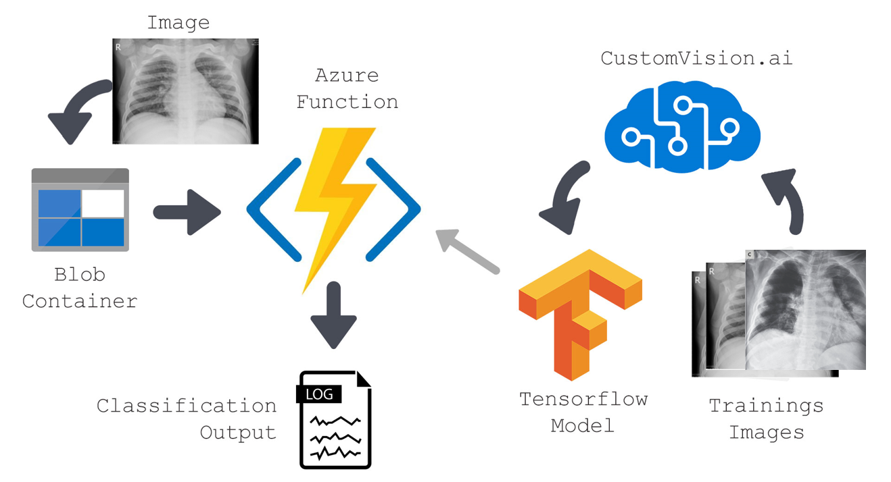

# AzureCustomVisionCOVID-19
As we continue to face the rapid increase in confirmed Coronavirus cases in India, we intend to create a robust pneumonia detection platform for COVID-19. The purpose is to assist doctors and radiologists in recognizing patients who are infected.The system is built to automatically detect high-risk patients with pneumonia or other chest diseases that will then send the information to doctors and health care professionals via secure network. With that information, the doctors are then able to make decisions and provide a treatment plan for the diagnosis and treatment. Any x-ray images taken for patients will automatically be uploaded to our system. Our system will then scan the images to determine whether the patients are infected. If the test is positive, the doctors will receive an e-Alert (on computer or mobile phone) that contains the original scans and detection results. Fast and Cheap Computer aided Diagnosis will prove extremely beneficial for people in rural India where there is acute paucity of trained radiologists and Doctors per capita. We will create an end-to-end Deep learning solution for Chest X-ray diagnosis. It will be a cost-effective solution for rural population with inadequate access to diagnostic imaging specialists.


Instructions:
1) Install the Tensorflow.js package for custom-vision models :
2) Replace the "model.json" with one given in the repo
# customvision-tfjs
NPM package for TensorFlow.js models exported from Custom Vision Service

## Install
```sh
npm install @microsoft/customvision-tfjs
```

Or, if you would like to use CDN,

```html
<script src="https://cdn.jsdelivr.net/npm/@tensorflow/tfjs@1.3.2/dist/tf.min.js"></script>
<script src="https://unpkg.com/@microsoft/customvision-tfjs"></script>
```

## Usage

```html

```

### Classification
```js
import * as cvstfjs from '@microsoft/customvision-tfjs';

let model = new cvstfjs.ClassificationModel();
await model.loadModelAsync('model.json');
const image = document.getElementById('image');
const result = await model.executeAsync(image);
```

The result is a 1D-array of probabilities.


### Instructions for running the Chest X-ray diagnostics model 
1) Unzip the the zip archive
2) create conda environment usinfg environment.yml file:
    "conda env create -f environment.yml"
3) Go to the gui folder and run Abhijit.py file
4) This will open up multilabel chest X-ray disease classifier 

### For GRAD CAM visualisation of localisation of COVID-19 in lungs
1) Run the TensorFlow_model_with_GRAD_CAM notebook, which has visualisation along 
   with the fine tuned Xception and Densenet 121 model.
